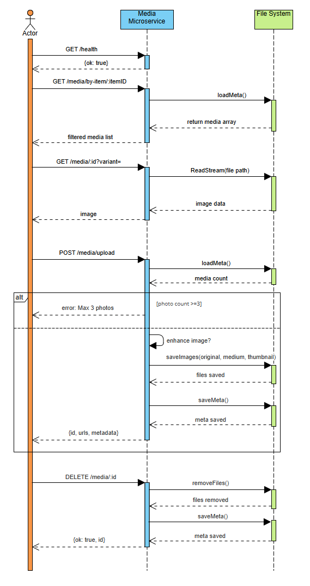

# Image Upload Microservice


## Description

The Image Upload Microservice is a standalone Node.js service designed to support external applications requiring image uploads, resizing, and optional auto-enhancement.
The service handles the following core responsibilities. It is adaptable to multiple applications like

- Inventory management systems
- Study trackers
- Budget trackers
- And projects that will need image processing

### Core Responsibilities and Features:  

- Accept uploaded image files via REST API
- Generate medium and thumbnail versions
- Apply optional automatic enhancement
- Store metadata in JSON format
- Limit images to 3 per itermId
- Provide retrieval and deletion endpoints  

- Produces:

    - Original full-resolution image
    - Medium version (max 1200px)
    
- Thumbnail version (max 320px)

    - JSON-based metadata storage (easily replaceable with a database).
    - Integrated test interface using EJS.
    - CORS-configurable for local or remote clients.


## Communication Contract

Defines the fixed API contract used by the main program. Once it is established, the contract will not change.

### REQUEST: Programmatically Sending Data to the Microservice 
POST /media/upload    

Form-data fields:    

Field: photo        Required: Yes    Description: Image file(JPEG, PNG, WebP)  
Field: itemId       Required: Yes    Description: ID of associated item  
Field: enhance      Required: Yes    Description: "true" to apply enhancehament  

#### Example Request (Node.js)  
``` js
const axios = require('axios');
const FormData = require('form-data');
const fs = require('fs');

async function uploadPhoto(photoPath, itemId) {
  const fd = new FormData();
  fd.append('photo', fs.createReadStream(photoPath));
  fd.append('itemId', itemId);
  fd.append('enhance', 'true');

  const res = await axios.post(
    process.env.MEDIA_SERVICE_BASE + '/media/upload',
    fd,
    { headers: fd.getHeaders() }
  );

  return res.data;
}

```

### RESPONSE: Receiving Data From the Microservice  

JSON Response Example  

``` json
{
  "id": "uuid",
  "itemId": "123",
  "paths": {
    "original": "/media/file.jpg",
    "medium": "/media/file_medium.jpg",
    "thumb": "/media/file_thumb.jpg"
  }
}
```

#### Error Responses  

Status: 400 Bad Request - Missing photo or itemId  
Status: 422 Unprocessable Entity - More than 3 images are already uploaded  


### Additional Endpoints   

- GET /health                                     : Returns service status.
- GET /media/by-item/:itemid                      : Returns all media entries for an item.  
- GET /media/:id?variant=original|medium|thumb    : Returns an image file.
- DELETE /media/:id                               : Deletes a media entry.


### Using This Microservice For Your Application  

To integrate this image uploader microservice with your application, use an HTTP proxy so your application can forward all image related requests to this microservice.  

#### Requirements  

Install the proxy middleware in your application.  

```
npm install http-proxy-middleware
```

#### Proxy Setup In Your Application  

Add the following to your application server file:

``` js
const { createProxyMiddleware } = require('http-proxy-middleware');

// Proxy for Image Uploader Microservice
app.use('/image', createProxyMiddleware({
  target: 'http://localhost:4001',
  changeOrigin: true,
  pathRewrite: { '^/image': '' }
}));

```

#### How It Works  
 Any request that begins with "/image" is forwarded directly to the image uploader microservice running on Port 4001.  

| Application Route    | Image Uploader Microservice Route |
|----------------------|-----------------------------------|
| /image/upload        | /upload                           |
| /image/media/mediaId | /media/mediaId                    | 
| /image/test          | /test                             |


#### Client Example  

For your application, you can upload an image like this:

``` js
fetch('/image/upload', {
  method: 'POST',
  body: formData
});

```


## UML Sequence Diagram
  
  

    

## Tech Stack

- Node.js (v18+)
- Express.js
- Multer (file uploads)
- Sharp (image processing)
- EJS (test interface)
- JSON file storage (`data/media.json`)


    
## Setup and Installation

1.	Install Node.js (v20 or higher recommended).
3.	Clone the repository.
4.	Run: npm install
5.	Create a .env file or use the provided .env.example.
6.	Start the microservice: node server.js
7.	Open the browser and navigate to: http://localhost:4001/test


## Configuration

| Variable           | Required | Default | Description                                   |
|--------------------|----------|---------|-----------------------------------------------|
| PORT               | No       | 4001    | Port the microservice listens on              |
| CORS_ORIGIN        | No       | *\**    | Allowed origin(s) for CORS                    |
| MEDIA_SERVICE_BASE | No       | —       | Used by client app to build request URLs      |


## Project Directory Structure


    image-upload-microservice/  
    ├── server.js # Main server logic  
    |  
    ├── package.json # Dependencies and scripts  
    |  
    ├── .env # Environment variables (not committed)  
    |  
    ├── data/  
    │    └── media.json # Image metadata storage  
    |  
    ├── storage/  
    │    ├── original/ # Full-resolution images  
    │    ├── medium/ # Resized 1200px images  
    │    └── thumb/ # Thumbnails (max 320px)  
    |  
    ├── views/  
    │    └── test.ejs # Integrated test page  
    |  
    └── README.md # Documentation


## Testing Tools

The integrated test.ejs page (/test) supports:

- Manual image uploads

- Listing media by itemId

- Viewing thumbnails/medium/original

- Deleting images

This enables quick validation without needing the main application.


## Deployment Guide  

Set your main application to use by placing the following in the .env file:  

``` ini
MEDIA_SERVICE_BASE=http://localhost:4001
```

### Local Development

- Run node server.js

- Access the test interface at /test


    
## License


MIT License
Copyright (c) 2025 Kristian Guevarra and Fu Shing Kong (Sam) 

Permission is hereby granted, free of charge, to any person obtaining a copy
of this software and associated documentation files (the "Software"), to deal
in the Software without restriction, including without limitation the rights    
to use, copy, modify, merge, publish, distribute, sublicense, and/or sell      
copies of the Software, and to permit persons to whom the Software is          
furnished to do so, subject to the following conditions:                        

The above copyright notice and this permission notice shall be included in all  
copies or substantial portions of the Software.                                 

THE SOFTWARE IS PROVIDED "AS IS", WITHOUT WARRANTY OF ANY KIND, EXPRESS OR      
IMPLIED, INCLUDING BUT NOT LIMITED TO THE WARRANTIES OF MERCHANTABILITY,        
FITNESS FOR A PARTICULAR PURPOSE AND NONINFRINGEMENT. IN NO EVENT SHALL THE     
AUTHORS OR COPYRIGHT HOLDERS BE LIABLE FOR ANY CLAIM, DAMAGES OR OTHER          
LIABILITY, WHETHER IN AN ACTION OF CONTRACT, TORT OR OTHERWISE, ARISING FROM,   
OUT OF OR IN CONNECTION WITH THE SOFTWARE OR THE USE OR OTHER DEALINGS IN THE  
SOFTWARE.

This project is license under the MIT License. You are free to use, modify, and distribute this software for any purpose, including commercial applications, as long as the original copyright notice is included.


    
## Authors

This project was developed collaboratively by the following CS361 students:
Kristian Guevarra and Fu Shing Kong (Sam)

